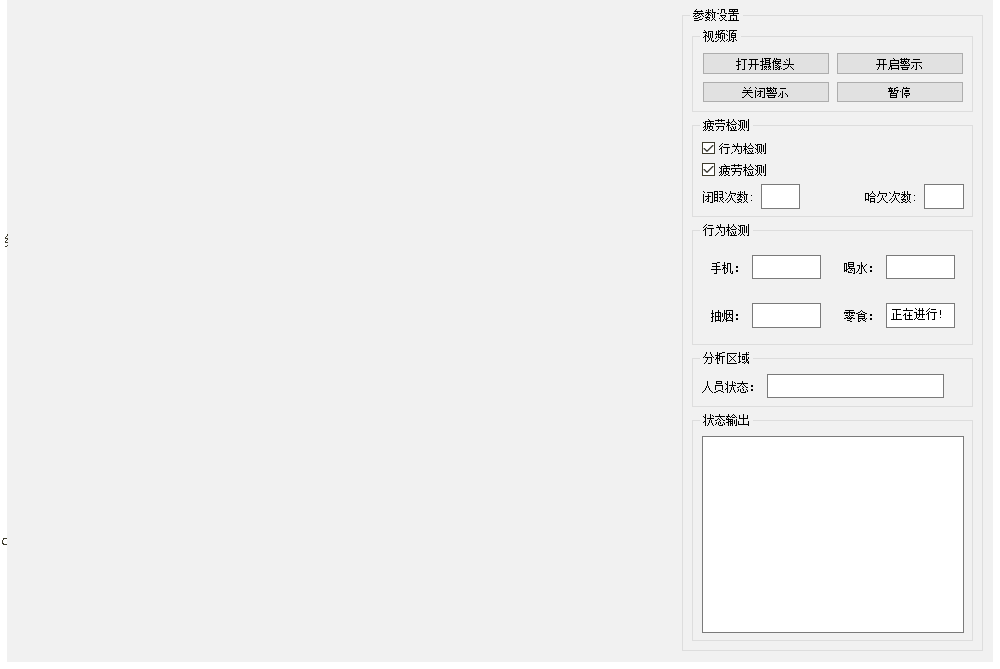

# 介绍

这是我的本科毕设，是一个基于python作为语言，opencv和yolov5做的分心疲劳驾驶检测，使用的是 pyside2作为框架。

项目还有很多没有完善的地方 ，最近忙着找工作和接单子没有多的时间来完善寻思不影响使用就暂时没有管

# 安装部署

1. ###### 下载安装

   ```
   git https://github.com/E6B3BD/YoloFatigueDistractedDrivingDetection.git
   ```

2. 使用Anconda

   ```
   conda create -n yolo5 python=3.8
   ```

   ```
   cd F:/YoloFatigueDistractedDrivingDetection
   ```

   #使用阿里源加速安装

   ```
   pip install -r requirements.txt -i https://mirrors.aliyun.com/pypi/simple/
   ```

3. 运行

   ```
   python main.py
   ```

# 运行演示



# 另外

训练yolo的数据集我会放在百度网盘上

```
链接：https://pan.baidu.com/s/1SqeNKVuE7e4fA1K9WIlKpQ?pwd=8pv4 
提取码：8pv4
```

训练的方法网上挺多可以自行寻找